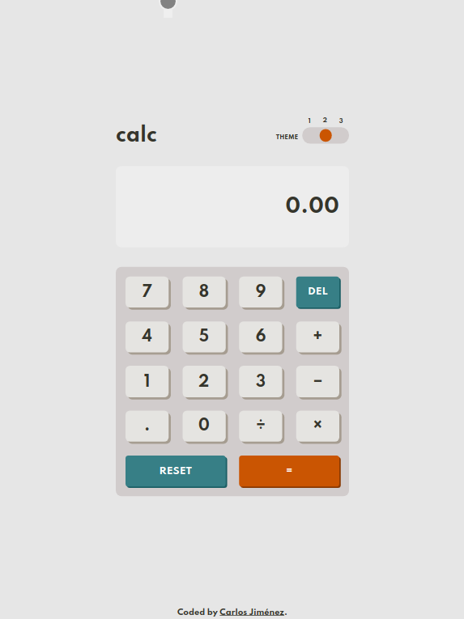
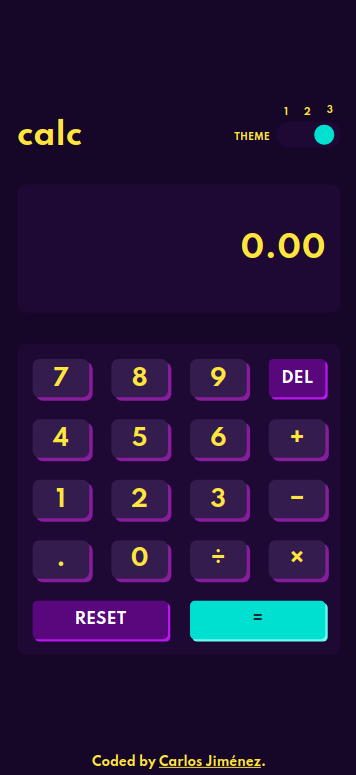

# Frontend Mentor - Calculator app solution

This is a solution to the [Calculator app challenge on Frontend Mentor](https://www.frontendmentor.io/challenges/calculator-app-9lteq5N29).

## Table of contents

- [Frontend Mentor - Calculator app solution](#frontend-mentor---calculator-app-solution)
  - [Table of contents](#table-of-contents)
  - [Overview](#overview)
    - [The challenge](#the-challenge)
    - [Screenshot](#screenshot)
    - [Links](#links)
    - [Built with](#built-with)
    - [Useful resources](#useful-resources)
  - [Author](#author)

## Overview

### The challenge

Users should be able to:

- See the size of the elements adjust based on their device's screen size
- Perform mathmatical operations like addition, subtraction, multiplication, and division
- Adjust the color theme based on their preference
- **Bonus**: Have their initial theme preference checked using `prefers-color-scheme` and have any additional changes saved in the browser

### Screenshot

### Links

- Solution URL: [Add solution URL here](https://github.com/Dghost32/calculator)
- Live Site URL: [Add live site URL here](https://calculator-cj.netlify.app)
### Built with

- Semantic HTML5 markup
- CSS custom properties
- Flexbox
- CSS Grid
- Mobile-first workflow
### Useful resources

- [MDN Web Docs](https://developer.mozilla.org/es/) - This site helped me when i couldn't remember how to use something in css or js. I really liked this site and will use it going forward.
- [Stack Overflow](https://stackoverflow.com/) - I used it to remember how to use slice() method, StackOverflow, always there for our needs <3.

## Author

- Website - [Carlos Jiménez](https://carlosjimenez.netlify.app)
- Frontend Mentor - [@Dghost32](https://www.frontendmentor.io/profile/Dghost32)
- Github - [@Dghost32](https://github.com/Dghost32/)

